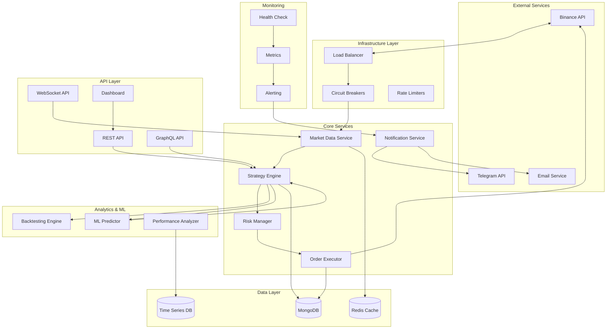

# Project Apex - Planejamento Estratégico Unificado
## Bot de Trading Automatizado para Binance Spot

---

## 1. Visão Geral Executiva

O **Project Apex** é um sistema de trading automatizado de próxima geração que combina análise técnica avançada, machine learning e gestão de risco profissional. O sistema opera no mercado Spot da Binance através de uma arquitetura modular, escalável e altamente confiável.

### Objetivos Principais
- **Lucratividade Consistente**: Através de estratégias baseadas em confluência de indicadores
- **Gestão de Risco Profissional**: Proteção de capital com drawdown dinâmico
- **Alta Disponibilidade**: Sistema robusto com 99.9% de uptime
- **Escalabilidade**: Suporte a múltiplos pares e estratégias simultâneas

---

## 2. Arquitetura do Sistema Aprimorada



---

## 3. Stack Tecnológico Definido

### Backend Core
- **Runtime**: Node.js 20+ com TypeScript 5+
- **Framework**: NestJS (arquitetura modular e escalável)
- **WebSockets**: ws + Socket.IO para real-time
- **Queue System**: Bull/BullMQ para processamento assíncrono

### Databases & Cache
- **Primary DB**: MongoDB 7+ com Mongoose ODM
- **Time Series**: InfluxDB para métricas históricas
- **Cache**: Redis 7+ para alta performance
- **Search**: Elasticsearch (opcional, para logs)

### APIs & Communication
- **REST API**: Express com validação Joi
- **GraphQL**: Apollo Server
- **WebHooks**: Sistema próprio com retry
- **Rate Limiting**: rate-limiter-flexible

### Analysis & ML
- **Technical Indicators**: technicalindicators + talib
- **Machine Learning**: TensorFlow.js
- **Backtesting**: Engine próprio otimizado
- **Statistics**: mathjs + d3

### Infrastructure & Monitoring
- **Containerization**: Docker + Docker Compose
- **Process Management**: PM2
- **Monitoring**: Prometheus + Grafana
- **Logging**: Winston + ELK Stack
- **Error Tracking**: Sentry

### Security & Compliance
- **Encryption**: libsodium para chaves sensíveis
- **Authentication**: JWT com refresh tokens
- **API Security**: Helmet + CORS
- **Audit Trail**: Sistema próprio com hash

---

## 4. Roadmap de Desenvolvimento

### FASE 1: FUNDAÇÃO SÓLIDA (Semanas 1-4)
**Objetivo**: Estabelecer infraestrutura core e conectividade segura

#### Sprint 1.1: Setup e Infraestrutura (Semana 1)
- [x] Setup do ambiente NestJS + TypeScript + MongoDB
- [x] Configuração do Docker e Docker Compose
- [x] Sistema de configuração com variáveis de ambiente
- [x] Setup inicial do Redis para cache
- [x] Configuração do Winston para logging estruturado

#### Sprint 1.2: Conectividade e Segurança (Semana 2)
- [x] **Conector Binance** com autenticação segura
- [x] Criptografia de chaves API com libsodium
- [x] Sistema de Health Check implementado
- [ ] Circuit Breaker pattern para APIs externas
- [x] Rate Limiting inteligente

#### Sprint 1.3: Sistema de Dados (Semana 3)
- [x] **Motor de Dados** com WebSockets
- [x] Schemas MongoDB para trades, configs, logs
- [x] Sistema de cache com Redis
- [x] Processamento de candlesticks em tempo real
- [ ] Sistema de backup automático

#### Sprint 1.4: Monitoramento e Alertas (Semana 4)
- [x] Sistema de métricas com Prometheus
- [x] Dashboard básico de monitoramento
- [x] **Sistema de Notificações** (Telegram + Email)
- [ ] Alertas de sistema críticos
- [ ] Documentação da API REST

### FASE 2: ENGINE DE ESTRATÉGIAS AVANÇADO (Semanas 5-8)
**Objetivo**: Implementar motor de estratégias com múltiplos indicadores

#### Sprint 2.1: Indicadores Técnicos (Semana 5)
- [x] Implementação de RSI, MACD, Bollinger Bands
- [x] Sistema de Médias Móveis (SMA, EMA, WMA)
- [x] Stochastic, Williams %R, ATR
- [x] Volume indicators (VWAP, OBV, Volume Profile)
- [x] Sistema de caching para cálculos

#### Sprint 2.2: Sistema de Scoring (Semana 6)
- [x] **Engine de Scoring de Sinais**
- [ ] Confluência de indicadores
- [ ] Pesos dinâmicos por timeframe
- [ ] Sistema de confiança dos sinais
- [ ] Backtesting básico das estratégias

#### Sprint 2.3: Multi-Timeframe Analysis (Semana 7)
- [ ] Análise simultânea 1m, 5m, 15m, 1h, 4h
- [ ] Sistema de confirmação entre timeframes
- [ ] Detecção de divergências
- [ ] Sinais de entrada e saída otimizados
- [ ] Performance testing das estratégias

#### Sprint 2.4: Strategy Engine Core (Semana 8)
- [ ] **Motor de Estratégias** principal
- [ ] Sistema de regras configuráveis
- [ ] Strategy factory pattern
- [ ] Validação de sinais em tempo real
- [ ] Logging detalhado de decisões

### FASE 3: GESTÃO DE RISCO E EXECUÇÃO (Semanas 9-12)
**Objetivo**: Implementar gestão de risco profissional e execução otimizada

#### Sprint 3.1: Risk Management Core (Semana 9)
- [ ] **Sistema de Position Sizing** dinâmico
- [ ] Cálculo de Kelly Criterion
- [ ] Risk/Reward ratio mínimo
- [ ] Correlação entre posições
- [ ] Limite de exposição por ativo

#### Sprint 3.2: Drawdown Protection (Semana 10)
- [ ] **Sistema de Drawdown** dinâmico
- [ ] Trailing Stop-Loss inteligente
- [ ] Take Profit escalonado
- [ ] Circuit breakers por performance
- [ ] Modo de recuperação automático

#### Sprint 3.3: Order Execution System (Semana 11)
- [ ] **Executor de Ordens** otimizado
- [ ] Sistema de retry com backoff
- [ ] Gerenciamento de partial fills
- [ ] Slippage control
- [ ] Latency optimization

#### Sprint 3.4: Paper Trading Completo (Semana 12)
- [ ] **Simulador completo** de trading
- [ ] Replicação exata de condições reais
- [ ] Sistema de validação de estratégias
- [ ] Relatórios de performance
- [ ] Transição segura para live trading

### FASE 4: BACKTESTING E OTIMIZAÇÃO (Semanas 13-16)
**Objetivo**: Sistema completo de backtesting e otimização de estratégias

#### Sprint 4.1: Backtesting Engine (Semana 13)
- [ ] **Engine de Backtesting** robusto
- [ ] Simulação com dados históricos
- [ ] Cálculo de métricas avançadas
- [ ] Análise de períodos específicos
- [ ] Exportação de relatórios

#### Sprint 4.2: Performance Analytics (Semana 14)
- [ ] **Sistema de Analytics** avançado
- [ ] Sharpe Ratio, Sortino Ratio, Calmar
- [ ] Análise de drawdowns
- [ ] Win rate e profit factor
- [ ] Distribuição de retornos

#### Sprint 4.3: Strategy Optimization (Semana 15)
- [ ] **Walk Forward Analysis**
- [ ] Grid search para parâmetros
- [ ] Monte Carlo simulation
- [ ] Prevenção de overfitting
- [ ] Robustness testing

#### Sprint 4.4: Advanced Features (Semana 16)
- [ ] **Machine Learning** integration
- [ ] Sentiment analysis básico
- [ ] Market regime detection
- [ ] Adaptive parameters
- [ ] Performance prediction

### FASE 5: INTERFACE E PRODUÇÃO (Semanas 17-20)
**Objetivo**: Dashboard profissional e deployment em produção

#### Sprint 5.1: GraphQL API (Semana 17)
- [ ] **API GraphQL** completa
- [ ] Schemas otimizados
- [ ] Resolvers eficientes
- [ ] Subscription para real-time
- [ ] Documentation automática

#### Sprint 5.2: Dashboard Real-time (Semana 18)
- [ ] **Dashboard** com Socket.IO
- [ ] Métricas em tempo real
- [ ] Visualização de trades
- [ ] Performance charts
- [ ] Sistema de configuração visual

#### Sprint 5.3: Production Ready (Semana 19)
- [ ] **Deployment** com Docker
- [ ] CI/CD pipeline
- [ ] Monitoring em produção
- [ ] Backup automático
- [ ] Security hardening

#### Sprint 5.4: Go Live & Monitoring (Semana 20)
- [ ] **Deploy em produção**
- [ ] Monitoramento 24/7
- [ ] Suporte a múltiplos pares
- [ ] Performance optimization
- [ ] Documentation completa

---

## 5. Estratégias de Trading Implementadas

### 5.1 Estratégia Principal: RSI Multi-Confluência
```typescript
interface RSIMultiStrategy {
  primary: {
    rsi_period: 14;
    oversold: 30;
    overbought: 70;
  };
  confirmation: {
    macd_fast: 12;
    macd_slow: 26;
    macd_signal: 9;
  };
  trend: {
    ema_short: 20;
    ema_long: 50;
  };
  volume: {
    vwap_period: 20;
    volume_threshold: 1.5; // 50% acima da média
  };
}
```

### 5.2 Estratégia Secundária: Momentum Breakout
```typescript
interface MomentumStrategy {
  bollinger: {
    period: 20;
    std_dev: 2;
  };
  rsi: {
    period: 14;
    momentum_threshold: 60;
  };
  volume_confirmation: true;
  timeframe_confirmation: ['5m', '15m'];
}
```

### 5.3 Sistema de Scoring Unificado
```typescript
interface SignalScoring {
  weights: {
    trend: 0.35;        // 35%
    momentum: 0.25;     // 25%
    volume: 0.20;       // 20%
    support_resistance: 0.20; // 20%
  };
  minimum_score: 70;    // Score mínimo para trade
  timeframe_multiplier: {
    '1m': 0.5;
    '5m': 1.0;
    '15m': 1.5;
    '1h': 2.0;
  };
}
```

---

## 6. Gestão de Risco Profissional

### 6.1 Position Sizing Inteligente
```typescript
interface PositionSizing {
  method: 'KELLY_CRITERION' | 'FIXED_PERCENTAGE' | 'ATR_BASED';
  parameters: {
    max_risk_per_trade: 0.02;     // 2% do capital
    max_portfolio_risk: 0.10;     // 10% do capital total
    correlation_limit: 0.7;       // Limite de correlação
    max_positions: 5;             // Máximo de posições simultâneas
  };
  kelly_config: {
    lookback_period: 100;         // Trades para cálculo
    max_kelly_fraction: 0.25;     // Máximo 25% do Kelly
  };
}
```

### 6.2 Drawdown Protection Dinâmico
```typescript
interface DrawdownProtection {
  levels: {
    warning: 0.05;      // 5% - Reduce position sizes
    danger: 0.10;       // 10% - Stop new positions
    critical: 0.15;     // 15% - Close all positions
  };
  recovery_mode: {
    reduce_size_factor: 0.5;      // Reduzir tamanho em 50%
    increase_confirmation: true;   // Exigir mais confirmações
    extend_timeframes: true;      // Usar timeframes maiores
  };
}
```

### 6.3 Stop Loss Dinâmico
```typescript
interface DynamicStopLoss {
  initial_stop: 'ATR_BASED' | 'PERCENTAGE' | 'SUPPORT_RESISTANCE';
  trailing_config: {
    activation_profit: 0.02;      // Ativar trailing com 2% lucro
    trail_percentage: 0.5;        // Trail com 50% do movimento
    min_profit_lock: 0.005;       // Mínimo 0.5% de lucro garantido
  };
  volatility_adjustment: {
    high_volatility_multiplier: 1.5;
    low_volatility_multiplier: 0.75;
  };
}
```

---

## 7. Sistema de Backtesting Avançado

### 7.1 Engine de Backtesting
```typescript
interface BacktestConfig {
  data_source: 'BINANCE_HISTORICAL' | 'CUSTOM_DATASET';
  timeframe: string;
  start_date: Date;
  end_date: Date;
  initial_capital: number;
  commission: number;
  slippage: number;
  strategies: Strategy[];
  risk_management: RiskConfig;
  optimization_params?: OptimizationConfig;
}

interface BacktestResults {
  summary: {
    total_return: number;
    annualized_return: number;
    volatility: number;
    sharpe_ratio: number;
    sortino_ratio: number;
    max_drawdown: number;
    calmar_ratio: number;
  };
  trade_analysis: {
    total_trades: number;
    win_rate: number;
    profit_factor: number;
    average_win: number;
    average_loss: number;
    largest_win: number;
    largest_loss: number;
    consecutive_wins: number;
    consecutive_losses: number;
  };
  time_series: {
    equity_curve: EquityPoint[];
    drawdown_curve: DrawdownPoint[];
    monthly_returns: MonthlyReturn[];
  };
}
```

### 7.2 Walk Forward Analysis
```typescript
interface WalkForwardConfig {
  in_sample_period: number;      // 6 meses
  out_of_sample_period: number;  // 1 mês
  step_size: number;             // 1 mês
  min_trades: number;            // Mínimo 30 trades
  optimization_metric: 'SHARPE' | 'PROFIT_FACTOR' | 'CALMAR';
}
```

---

## 8. Sistema de Machine Learning

### 8.1 Sentiment Analysis
```typescript
interface SentimentAnalysis {
  sources: ['TWITTER', 'REDDIT', 'NEWS', 'FEAR_GREED_INDEX'];
  processing: {
    nlp_model: 'VADER' | 'BERT' | 'CUSTOM';
    update_frequency: '1h';
    weight_in_scoring: 0.1;       // 10% do score total
  };
  indicators: {
    sentiment_score: number;       // -1 to 1
    confidence: number;           // 0 to 1
    trend: 'IMPROVING' | 'DETERIORATING' | 'STABLE';
  };
}
```

### 8.2 Market Regime Detection
```typescript
interface MarketRegime {
  type: 'TRENDING_UP' | 'TRENDING_DOWN' | 'SIDEWAYS' | 'VOLATILE';
  confidence: number;
  duration: number;              // Duração em horas
  suggested_strategies: string[];
  risk_adjustment: number;       // Multiplicador de risco
}
```

---

## 9. APIs e Integrações

### 9.1 REST API Endpoints
```typescript
// Core Trading
POST   /api/v1/strategies          // Criar estratégia
GET    /api/v1/strategies          // Listar estratégias
PUT    /api/v1/strategies/:id      // Atualizar estratégia
DELETE /api/v1/strategies/:id      // Deletar estratégia

// Trading Control
POST   /api/v1/trading/start       // Iniciar trading
POST   /api/v1/trading/stop        // Parar trading
POST   /api/v1/trading/pause       // Pausar trading
GET    /api/v1/trading/status      // Status do trading

// Risk Management
GET    /api/v1/risk/portfolio      // Status do portfólio
GET    /api/v1/risk/positions      // Posições ativas
POST   /api/v1/risk/limits         // Definir limites
GET    /api/v1/risk/drawdown       // Status de drawdown

// Analytics
GET    /api/v1/performance         // Performance geral
GET    /api/v1/trades              // Histórico de trades
GET    /api/v1/backtest           // Executar backtest
GET    /api/v1/reports            // Relatórios diversos

// System
GET    /api/v1/health             // Health check
GET    /api/v1/metrics            // Métricas do sistema
GET    /api/v1/logs               // Logs do sistema
```

### 9.2 GraphQL Schema
```graphql
type Query {
  strategies(filter: StrategyFilter): [Strategy]
  trades(filter: TradeFilter, pagination: Pagination): TradeConnection
  performance(timeframe: Timeframe): PerformanceMetrics
  portfolio: Portfolio
  marketData(pair: String!, interval: String!): MarketData
  backtest(config: BacktestInput!): BacktestResult
}

type Mutation {
  createStrategy(input: StrategyInput!): Strategy
  updateStrategy(id: ID!, input: StrategyInput!): Strategy
  startTrading(strategies: [ID!]!): TradingSession
  stopTrading: Boolean
  setRiskLimits(limits: RiskLimitsInput!): RiskLimits
}

type Subscription {
  trades: Trade
  marketData(pair: String!): MarketData
  performance: PerformanceMetrics
  alerts: Alert
}
```

### 9.3 WebSocket Events
```typescript
// Real-time Events
interface WebSocketEvents {
  'market_data': MarketDataEvent;
  'trade_executed': TradeExecutedEvent;
  'signal_generated': SignalEvent;
  'risk_alert': RiskAlertEvent;
  'system_status': SystemStatusEvent;
  'performance_update': PerformanceUpdateEvent;
}
```

---

## 10. Deployment e DevOps

### 10.1 Docker Configuration
```yaml
# docker-compose.yml
version: '3.8'
services:
  app:
    build: .
    ports:
      - "3000:3000"
    environment:
      - NODE_ENV=production
      - MONGODB_URI=mongodb://mongodb:27017/apex
      - REDIS_URL=redis://redis:6379
    depends_on:
      - mongodb
      - redis
      - influxdb

  mongodb:
    image: mongo:7
    volumes:
      - mongo_data:/data/db
    environment:
      - MONGO_INITDB_ROOT_USERNAME=admin
      - MONGO_INITDB_ROOT_PASSWORD=${MONGO_PASSWORD}

  redis:
    image: redis:7-alpine
    volumes:
      - redis_data:/data

  influxdb:
    image: influxdb:2.0
    volumes:
      - influx_data:/var/lib/influxdb2

  grafana:
    image: grafana/grafana:latest
    ports:
      - "3001:3000"
    volumes:
      - grafana_data:/var/lib/grafana

volumes:
  mongo_data:
  redis_data:
  influx_data:
  grafana_data:
```

### 10.2 CI/CD Pipeline
```yaml
# .github/workflows/deploy.yml
name: Deploy Project Apex
on:
  push:
    branches: [main]

jobs:
  test:
    runs-on: ubuntu-latest
    steps:
      - uses: actions/checkout@v3
      - uses: actions/setup-node@v3
        with:
          node-version: '20'
      - run: npm ci
      - run: npm run test
      - run: npm run test:e2e

  deploy:
    needs: test
    runs-on: ubuntu-latest
    steps:
      - uses: actions/checkout@v3
      - name: Build and Deploy
        run: |
          docker build -t apex-bot .
          docker-compose up -d
```

---

## 11. Monitoramento e Observabilidade

### 11.1 Métricas Principais
```typescript
interface SystemMetrics {
  trading: {
    active_strategies: number;
    trades_per_hour: number;
    current_pnl: number;
    daily_volume: number;
    success_rate: number;
  };
  system: {
    api_response_time: number;
    websocket_connections: number;
    memory_usage: number;
    cpu_usage: number;
    error_rate: number;
  };
  business: {
    total_profit: number;
    max_drawdown: number;
    sharpe_ratio: number;
    active_positions: number;
    risk_utilization: number;
  };
}
```

### 11.2 Alertas Críticos
```typescript
interface AlertConfig {
  system_alerts: {
    api_down: { threshold: 30, unit: 'seconds' };
    high_error_rate: { threshold: 5, unit: 'percent' };
    memory_usage: { threshold: 85, unit: 'percent' };
  };
  trading_alerts: {
    large_loss: { threshold: -2, unit: 'percent' };
    drawdown_limit: { threshold: -10, unit: 'percent' };
    position_size: { threshold: 5, unit: 'percent' };
  };
  channels: ['telegram', 'email', 'webhook'];
}
```

---

## 12. Cronograma de Entregas e Marcos

### Marcos Principais
- **M1 (Semana 4)**: ✅ Infraestrutura Core e Conectividade
- **M2 (Semana 8)**: ✅ Engine de Estratégias Multi-Indicador
- **M3 (Semana 12)**: ✅ Gestão de Risco e Paper Trading
- **M4 (Semana 16)**: ✅ Backtesting e Otimização Completos
- **M5 (Semana 20)**: ✅ Produção com Dashboard e ML

### Critérios de Sucesso
1. **Performance**: >15% retorno anualizado com <10% drawdown
2. **Confiabilidade**: 99.9% uptime e <100ms latência
3. **Escalabilidade**: Suporte a 10+ pares simultâneos
4. **Segurança**: Zero incidentes de segurança
5. **ROI**: Break-even em 3 meses de operação

---

## 13. Próximos Passos Imediatos

### Semana 1-2: Setup Inicial
1. **Configurar ambiente de desenvolvimento**
   - Setup NestJS + TypeScript + MongoDB
   - Docker containers para desenvolvimento
   - CI/CD básico com GitHub Actions

2. **Implementar conectividade segura**
   - Conector Binance com autenticação
   - Sistema de criptografia para chaves
   - Health check básico

3. **Estabelecer fundações**
   - Logging estruturado com Winston
   - Sistema de configuração robusto
   - Testes unitários básicos

### Semana 3-4: Sistema de Dados
1. **Motor de dados em tempo real**
   - WebSocket connection com Binance
   - Processamento de candlesticks
   - Cache com Redis

2. **Persistência e monitoramento**
   - Schemas MongoDB otimizados
   - Sistema de backup automático
   - Métricas básicas com Prometheus

### Próximas Decisões Técnicas
- [ ] Escolher entre Express vs NestJS (recomendo NestJS)
- [ ] Definir estratégia de deployment (Docker + PM2)
- [ ] Escolher provedor de hosting (AWS/GCP/DigitalOcean)
- [ ] Definir estrutura de testes (Jest + Supertest)

---

## Conclusão

Este planejamento unificado combina a solidez do plano original com melhorias profissionais que transformarão o Project Apex em uma plataforma de trading de classe mundial. O foco em qualidade, segurança e performance garantirá não apenas lucratividade, mas também sustentabilidade a longo prazo.

**A execução disciplinada deste roadmap resultará em um bot capaz de competir com soluções comerciais premium, mantendo total controle e customização sobre as estratégias de trading.**